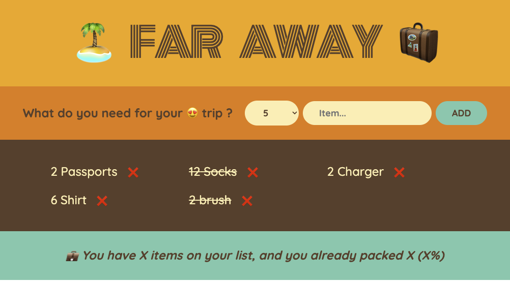

# 🏝️ Far Away - Travel Packing List App 🧳



## 📋 Project Overview
A simple and intuitive React app for managing travel packing lists. Add items, mark them as packed, sort your list, and track your packing progress with a clean, user-friendly interface.

## 🚀 How It Works
1. **Add Items**: Enter item description and quantity
2. **Track Progress**: Check off items as you pack them
3. **Sort Lists**: Organize by input order, description, or packed status
4. **Clear All**: Remove all items with confirmation dialog
5. **Visual Feedback**: See completion percentage and motivational messages

## ⚛️ React Concepts Learned
• **useState Hook** - Managing component state for items, sorting, and form inputs
• **Event Handling** - onSubmit, onChange, onClick event handlers
• **Conditional Rendering** - Displaying different UI based on state conditions
• **Component Props** - Passing data and functions between parent/child components
• **Array Methods** - map(), filter(), sort() for rendering and data manipulation
• **Controlled Components** - Form inputs controlled by React state
• **Component Composition** - Breaking UI into reusable, modular components
• **State Lifting** - Managing shared state in parent component

## 📁 Project Structure
```
far-away/
├── public/
│   ├── favicon.ico
│   ├── index.html
│   └── manifest.json
├── src/
│   ├── components/
│   │   ├── App.js
│   │   ├── Form.js
│   │   ├── Item.js
│   │   ├── Logo.js
│   │   ├── PackingList.js
│   │   └── Status.js
│   ├── index.css
│   ├── index.js
│   └── test.js
├── package.json
├── project-image.png
└── README.md
```

## 💻 Installation & Setup

### Prerequisites
- Node.js (v14 or higher)
- npm or yarn

### Steps
1. **Clone the repository**
   ```bash
   git clone https://github.com/ashifulalam/Far-Away.git
   cd far-away
   ```

2. **Install dependencies**
   ```bash
   npm install
   ```

3. **Start the development server**
   ```bash
   npm start
   ```

4. **Open in browser**
   - Navigate to `http://localhost:3000`
   - The app will automatically reload when you make changes
